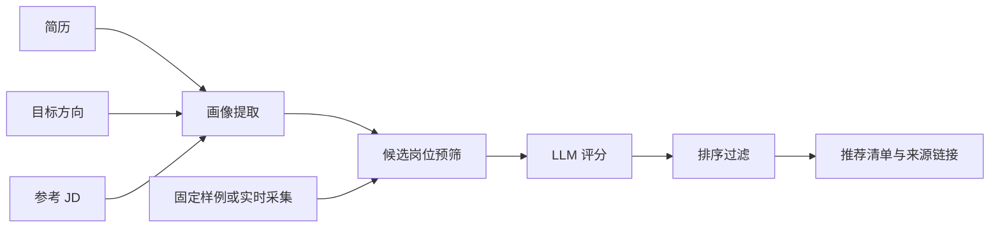

# Reverse Job Match Agent


一个用于产品运营实习求职展示的岗位逆向匹配 Demo。输入简历、目标岗位方向和参考 JD，输出按匹配度排序的岗位推荐清单，并给出匹配理由与能力缺口。

## 项目价值

传统招聘工具通常先抓取大量岗位，再拿简历逐个匹配。本项目反过来，先从目标 JD 中提取岗位画像，再检索和评估候选岗位，让“我想找什么岗位”成为搜索起点。解决求职者因为没有大量时间刷求职软件从而错过心仪岗位的痛点。

## 功能

- 固定样例模式：使用本地脱敏岗位数据，稳定演示。
- 实时采集模式：只读获取真实岗位列表，不发送消息或投递。
- 结构化画像提取：区分候选人证据与目标岗位要求。
- LLM 匹配评分：默认使用本地规则评分，配置 DeepSeek 后自动切换真实模型。
- 本地网页：输入材料、切换模式、查看来源、匹配分和推荐理由。

## 架构



## 快速启动

### 本地网页

```powershell
python server.py
```

打开 `http://127.0.0.1:8765`。

### 固定样例

```powershell
python main.py --mode demo
```

### 实时采集

首次使用先安装开源采集组件：

```powershell
setup_vendor.bat
```

然后启动专用浏览器登录 BOSS 直聘：

```powershell
setup_browser.bat
```

最后运行：

```powershell
python main.py --mode live
```

## 项目结构

```text
src/reverse_job_match/
├─ cli.py
├─ config.py
├─ models.py
├─ data_loader.py
├─ profile.py
├─ score.py
├─ mock_client.py
├─ llm_client.py
├─ prompts.py
├─ report.py
├─ collector_adapter.py
└─ pipeline.py

data/
├─ jobs_fixture.json
├─ demo_resume.md
├─ demo_direction.txt
└─ demo_reference_jd.md

static/
├─ index.html
├─ styles.css
└─ app.js

tests/
└─ ...
```

## 技术栈

- Python 3.11
- 标准库 HTTP 服务
- 原生 HTML、CSS、JavaScript
- OpenAI 兼容 LLM 接口
- BOSS 直聘开源采集组件

## 配置真实 LLM

复制 `.env.example` 的结构，在本地 `.env` 中配置：

```text
LLM_API_KEY=your_key
LLM_BASE_URL=https://api.deepseek.com/v1
LLM_MODEL=deepseek-v4-flash
```

未配置 API Key 时会使用规则评分器，便于离线演示。

## 合规边界

- 实时采集只读取岗位数据。
- 不发送消息、不打招呼、不投递。
- 不绕过验证码或访问控制。
- 不将个人简历、API Key 或真实采集数据提交到仓库。

## 测试

```powershell
$env:PYTHONPATH='src'
python -m unittest discover -s tests -v
```

## License

MIT
